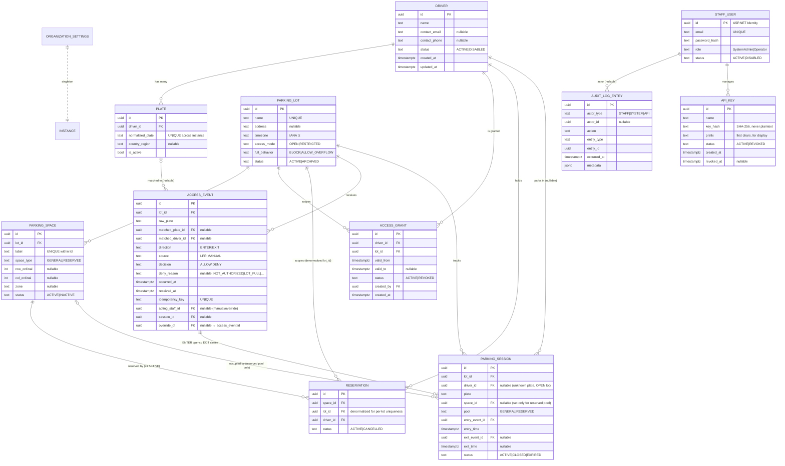
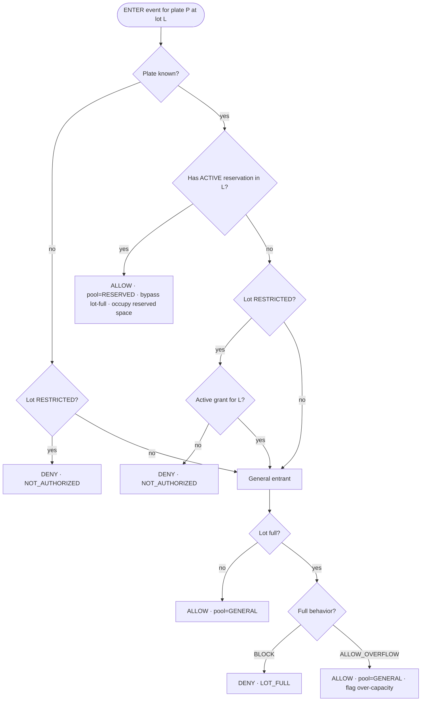

# System Architecture — Parking Management System

| | |
|---|---|
| **Source** | PRD v0.1 (2026-07-12) |
| **Stack (fixed)** | React + TypeScript · .NET 10 · PostgreSQL |
| **Deployment** | Single-tenant — one instance + one database per client company |
| **Backend pattern** | Ardalis Minimal Clean Architecture (Feature based) · FastEndpoints (REPR: Request/Endpoint/Response + `Validator<T>` + `Mapper<TRequest,TResponse,TEntity>`) · Mediator · EF Core |
| **Frontend pattern** | Vite · feature-based · shadcn/Tailwind · TanStack Router + Query · Axios · Zod |
| **Status** | Architecture confirmed. Creating MVP for V1 (highest priority tasks)  |

> The SPA uses **same-site HttpOnly cookie auth** via ASP.NET Core Identity — the PRD's recommended default (§8, Q6) — since it's the only client and this avoids token-theft/XSS exposure entirely. The gate/LPR integration and any future non-browser clients authenticate with a separate **API key** scheme (`X-Api-Key`), not JWT. See §7.

---

## 1. Architectural Drivers (what shapes every decision below)

These pull directly from the PRD and dictate the structure of the system:

1. **The inbound Access Events API is the single most important interface** (§8 reconciliation, E1–E3). It is synchronous, latency-bound (**p95 < 300 ms / p99 < 800 ms**, §7), idempotent, machine-authenticated, and its decision logic is the product's core IP. It gets first-class treatment: its own endpoint, its own auth scheme, its own domain service, and a dedicated hot read path.
2. **The Entry Decision Engine is domain logic, not controller logic** (E3, Data-model rule 4). It must be unit-testable in isolation, deterministic, and the single source of truth. It lives in the Core/Domain layer as a domain service.
3. **Single-tenant** (§8). No tenant column, no row-level tenancy filters, no cross-company joins. Simplifies the model enormously; the scaling axis is *number of instances*, not per-instance load.
4. **Server-side authorization is mandatory** (A2). Every endpoint authorizes by role; the SPA only *hides* what a role can't do — it never *enforces*.
5. **Everything material is audited and append-only** (G1, rule 11). Audit is a cross-cutting concern wired via an EF Core interceptor + explicit decision logging, not scattered `_audit.Log(...)` calls.
6. **GDPR is in scope** (Q1, G2 — **P1**, rule 12). The schema bakes in retention/erasure support from day one (denormalized `plate` for in-place anonymization, etc.) even though the retention/export/erasure UI itself is P1 — build it in v1 if time allows, but it's not a launch blocker.
7. **The .NET API must be stateless.**

---

## 2. High-Level Architecture

ASCII as requested. The dashed boundary is the single deployed tenant instance; the LPR/gate hardware is explicitly **outside** the product (PRD §8, out-of-scope #6).

```
                          EXTERNAL TO THE PRODUCT (not built, not controlled)
        ┌───────────────────────────────────────────────────────────────────────┐
        │   LPR / ANPR Camera  ──▶  Barrier-Gate Controller  ──▶  acts on ALLOW/DENY │
        └───────────────────────────────────┬───────────────────────────────────┘
                                             │  HTTPS  POST /api/v1/access-events
                                             │  Auth: X-Api-Key  (hashed, rotatable)
                                             │  Idempotency-Key required
                                             ▼
══════════════════════════ SINGLE TENANT INSTANCE (one company) ═══════════════════════════
║                                                                                          ║
║   Staff browsers (SPA)                                                                   ║
║   ┌────────────────────────┐                                                             ║
║   │  React + TS SPA         │  HTTPS / JSON                                              ║
║   │  (Vite, shadcn, TanStack)│────────────┐                                              ║
║   │  Admin · Operator        │  HttpOnly   │                                             ║
║   └────────────────────────┘  session     │                                             ║
║                                 cookie     │                                             ║
║                                            ▼                                             ║
║                            ┌───────────────────────────────────┐                        ║
║                            │   Reverse proxy / Ingress (TLS)    │  rate-limit, HSTS      ║
║                            └───────────────┬───────────────────┘                        ║
║                                            ▼                                             ║
║   ┌──────────────────────────────────────────────────────────────────────────────────┐ ║
║   │                .NET 10 API   (stateless · 1..N replicas for HA)                     │ ║
║   │  ┌────────────────────────────────────────────────────────────────────────────┐  │ ║
║   │  │ Api (FastEndpoints / REPR)                                                   │  │ ║
║   │  │   • Cookie auth scheme  • API-key auth scheme  • RBAC policies               │  │ ║
║   │  │   • Validator<T> + Mapper<T,T,T>  • ProblemDetails errors  • Swagger/OpenAPI  │  │ ║
║   │  └───────────────┬──────────────────────────────┬─────────────────────────────┘  │ ║
║   │                  │ Mediator commands/queries      │                                  │ ║
║   │  ┌───────────────▼──────────────┐   ┌────────────▼───────────────────────────────┐ │ ║
║   │  │ Feature slices (Application)  │   │ Cross-cutting (Mediator pipeline behaviors) │ │ ║
║   │  │  command/query handlers,      │   │  validation · logging · audit enrich       │ │ ║
║   │  │  DTOs, orchestration          │   └────────────────────────────────────────────┘ │ ║
║   │  └───────────────┬──────────────┘                                                  │ ║
║   │  ┌───────────────▼──────────────────────────────────────────────────────────────┐ │ ║
║   │  │ Core (Domain) — NO outward dependencies                                        │ │ ║
║   │  │   Aggregates: ParkingLot/Space · Driver/Plate · AccessGrant · Reservation ·    │ │ ║
║   │  │               ParkingSession · AccessEvent · AuditLogEntry · OrgSettings        │ │ ║
║   │  │   ★ EntryDecisionService (the gate's single source of truth)                    │ │ ║
║   │  │   ★ OccupancyCalculator · Specifications · Domain Events · Guard clauses         │ │ ║
║   │  └───────────────────────────────────────────────────────────────────────────────┘ │ ║
║   │  ┌───────────────────────────────────────────────────────────────────────────────┐ │ ║
║   │  │ Infrastructure  (implements Core interfaces)                                    │ │ ║
║   │  │   EF Core (Npgsql) · repositories (Ardalis.Specification) · ASP.NET Identity    │ │ ║
║   │  │   cookie auth (Identity) · API-key hashing · email sender · audit interceptor   │ │ ║
║   │  │   background jobs (session auto-expiry, retention purge)                         │ │ ║
║   │  └───────────────┬─────────────────────────────────────┬─────────────────────────┘ │ ║
║   └──────────────────┼─────────────────────────────────────┼───────────────────────────┘ ║
║                      ▼                                     ▼                              ║
║          ┌────────────────────────┐          ┌──────────────────────────────┐            ║
║          │ PostgreSQL (primary)    │          │ SMTP / transactional email    │            ║
║          │ at-rest encryption      │          │ (password reset — P2, post-v1)│            ║
║          │ EF code-first migrations│          └──────────────────────────────┘            ║
║          │ (+ optional read replica)│                                                      ║
║          └────────────────────────┘                                                       ║
║                                                                                          ║
║   Observability: Serilog (structured) · /health (live+ready) · request metrics            ║
══════════════════════════════════════════════════════════════════════════════════════════
                              Packaged as Docker image(s), provisioned per company via IaC
```

> **Note:** the boxes above (Api / Feature slices / Core / Infrastructure) are **folders inside one `Parkin.Api` project**, not separate assemblies — see §3 (Ardalis **Minimal** Clean Architecture, already scaffolded in `backend/`).

**Component responsibilities at a glance**

| Component | Responsibility | Key PRD ties |
|---|---|---|
| React SPA | Staff UI for both roles; renders tabular spaces view (2D map deferred, not in v1); gate console | F1 (post-v1), F2, E4–E7, A1 |
| Reverse proxy / ingress | TLS termination, HSTS, global rate limiting on `/auth/*` and `/access-events` | §7 Security |
| Api (FastEndpoints) | HTTP surface, two auth schemes, RBAC, request validation, error shaping | A1–A5, E1–E3 |
| Feature slices (`<Name>Features/`) | Endpoint + Command/Query + Handler per slice, via Mediator; transaction boundaries; DTO mapping | all CRUD epics |
| Domain (`Domain/<Name>Aggregate/`) | Entities/aggregates, invariants, **EntryDecisionService**, occupancy math | E3, rules 1–12 |
| Infrastructure (`Infrastructure/`) | Persistence, Identity (cookie auth), API keys, email, background jobs | §6, §7 |
| PostgreSQL | Single source of truth; constraints enforce invariants the app also checks | §6 |
| Background jobs | Auto-expiry of stale sessions (P1), retention purge/anonymization (GDPR) | E8, G2 |

---

## 3. .NET Solution Structure (Ardalis Minimal Clean Architecture)

Per the [Minimal Clean Architecture](https://ardalis.github.io/CleanArchitecture/minimal-clean-architecture/) variant — **already scaffolded in `backend/`** — this is **one Api project**, not the 4-project (`Core`/`UseCases`/`Infrastructure`/`Web`) full template. Layers are **folders + namespace convention**, not project references; boundaries are enforced by **NsDepCop** (`config.nsdepcop`, compiled as an error) rather than the compiler refusing an assembly reference. Features are organized as **vertical slices**: each `<Name>Features/` folder colocates its Endpoint + Request/Response + Validator + Mapper, and — for anything beyond simple CRUD — a Command/Query + Handler dispatched via **Mediator**. Simple CRUD may skip Mediator and hit the repository directly from the endpoint (mirrors the template's `ProductFeatures/Create` vs. `CartFeatures/AddToCart` split).

Patterns/packages already wired in the template: **FastEndpoints** (REPR — Request-Endpoint-Response, the modern replacement for MVC controllers), **Mediator** (martinothamar, source-generated — *not* MediatR) for use-case dispatch, **Ardalis.Specification** for query encapsulation, **Ardalis.Result** to carry success/validation/notfound out of handlers without throwing, **Ardalis.GuardClauses** for invariant guards, **Vogen** for strongly-typed IDs/value objects.

**Validation and mapping, specifically:**
- **`FastEndpoints.Validator<TRequest>`** — every slice's validator inherits this, not plain FluentValidation's `AbstractValidator<T>` directly. It *is* `AbstractValidator<T>` under the hood (FastEndpoints depends on the real `FluentValidation` NuGet package, confirmed in `project.assets.json` — same `RuleFor(...)` syntax, no reimplementation), but the FastEndpoints subclass adds **assembly-scan auto-discovery** (no manual DI registration, no injecting `IValidator<T>`) and **automatic `400`/`ValidationProblem` shaping** before `ExecuteAsync` ever runs — matching the `Results<..., ValidationProblem, ...>` return type every endpoint declares. There is **no separate Mediator `ValidationBehavior`**; validation happens at the FastEndpoints layer, upstream of Mediator dispatch (the template's `MediatorConfig.cs` currently registers only a `LoggingBehavior`).
- **`FastEndpoints.Mapper<TRequest, TResponse, TEntity>`** — used on slices that shape a domain entity/DTO into a response (`FromEntity(...)`), e.g. `CartFeatures/AddToCart`, `CartFeatures/GetById`, `ProductFeatures/GetById`, `ProductFeatures/List`. **Optional, not mandatory per slice**: trivial CRUD that maps inline (e.g. `ProductFeatures/Create`, which builds its `ProductRecord` response directly in `ExecuteAsync`) skips the `Mapper` class entirely — add one only when the mapping is reused or the slice is Mediator-driven.

Example structure that was created during architecture phase.
```
Parkin.slnx
│
├── src/
│   │
│   └── Parkin.Api/                              ← the ONE project. Everything below is a folder, not an assembly.
│       ├── Domain/                              ← NsDepCop: cannot reference Infrastructure.*
│       │   ├── ParkingLotAggregate/
│       │   │   ├── ParkingLot.cs                 (aggregate root: name, tz, AccessMode, FullBehavior, status)
│       │   │   ├── ParkingLotId.cs                (Vogen [ValueObject<int>])
│       │   │   ├── ParkingSpace.cs                (entity within the lot: label, SpaceType, row/col/zone, status)
│       │   │   ├── Events/LotArchivedEvent.cs, SpaceDeactivatedEvent.cs
│       │   │   └── Specifications/ActiveSpacesByLotSpec.cs, LotByNameSpec.cs
│       │   ├── DriverAggregate/
│       │   │   ├── Driver.cs                      (root: name, contact, status)
│       │   │   ├── DriverId.cs                    (Vogen [ValueObject<Guid>])
│       │   │   ├── Plate.cs                       (entity: NormalizedPlateNumber, region, active)
│       │   │   └── Specifications/PlateByNormalizedValueSpec.cs, DriverWithPlatesSpec.cs
│       │   ├── AccessGrantAggregate/
│       │   │   ├── AccessGrant.cs                 (root: driverId, lotId, validFrom, validTo?, status)
│       │   │   └── Specifications/ActiveGrantForDriverLotSpec.cs
│       │   ├── ReservationAggregate/
│       │   │   ├── Reservation.cs                 (root: spaceId, lotId, driverId, status — ACTIVE|CANCELLED; no dates, no created-by/at — audited separately)
│       │   │   └── Specifications/ActiveReservationBySpaceSpec.cs, ActiveReservationByDriverLotSpec.cs
│       │   ├── SessionAggregate/
│       │   │   ├── ParkingSession.cs              (root: lotId, driverId?, plate, spaceId?, Pool, entry/exit refs, status)
│       │   │   └── Specifications/ActiveSessionsByLotSpec.cs, OpenSessionForPlateSpec.cs
│       │   ├── AccessEventAggregate/
│       │   │   ├── AccessEvent.cs                 (root, immutable: lotId, rawPlate, matched ids, dir, source, decision, reason, idempotencyKey, …)
│       │   │   └── Enums/Direction.cs, EventSource.cs, Decision.cs, DenyReason.cs (Ardalis.SmartEnum)
│       │   ├── AuditAggregate/
│       │   │   └── AuditLogEntry.cs               (root, append-only: actorType, actorId?, action, entityType, entityId, ip?, metadata json)
│       │   ├── OrganizationAggregate/
│       │   │   └── OrganizationSettings.cs        (singleton: branding, default tz, default full-behavior, retentionDays)
│       │   ├── Services/
│       │   │   ├── IEntryDecisionService.cs
│       │   │   ├── EntryDecisionService.cs       ★ implements rule-4 precedence; pure, deterministic, no I/O
│       │   │   ├── IOccupancyCalculator.cs
│       │   │   └── OccupancyCalculator.cs        (general free = capacity − active general sessions, floored at 0)
│       │   └── Interfaces/                        (IEmailSender, IApiKeyHasher, IDateTime, ICurrentActor)
│       │
│       ├── ParkingLotFeatures/  { Create, Update, Archive, GetById, List }/  (Endpoint + Request/Response + Validator [+ Command/Handler for non-trivial ones])
│       ├── SpaceFeatures/       { Create, Update, Deactivate, ListByLot }/
│       ├── DriverFeatures/      { Create, Update, AssignPlate, ReassignPlate, BulkImport(P1), Export, Anonymize }/
│       ├── GrantFeatures/       { Grant, Revoke, ListForDriver }/
│       ├── ReservationFeatures/ { Create, Cancel, ListByLot }/  (reserve/free a space for a driver from the space's row — no separate screen)
│       ├── AccessEventFeatures/
│       │   └── Ingest/IngestEndpoint.cs + IngestAccessEventCommand.cs + Handler.cs  ★ orchestrates decision + session + audit in one tx
│       ├── OccupancyFeatures/   { GetLotOccupancy, GetMultiLotDashboard(P1) }/
│       ├── SessionFeatures/     { ListActive, CloseStale, ResetLotCount }/   (reconciliation — E7)
│       ├── AuditFeatures/       { Query }/
│       ├── UserFeatures/        { Create, Disable, ChangeRole, List }/
│       ├── ApiKeyFeatures/      { Generate, List, Revoke }/
│       │   *(NsDepCop: `*Features.*` cannot reference `Infrastructure.*` — depend on Domain abstractions, injected via DI)*
│       │
│       ├── Infrastructure/                       ← implements Domain interfaces
│       │   ├── Data/
│       │   │   ├── AppDbContext.cs                (domain DbContext — see note on one-vs-two DbContexts below)
│       │   │   ├── Config/  *Configuration.cs, VogenEfCoreConverters.cs  (IEntityTypeConfiguration per aggregate — indexes/constraints live here; every Vogen ID must be registered here)
│       │   │   ├── Migrations/                    (EF code-first, applied + seeded on startup)
│       │   │   ├── EfRepository.cs                 (Ardalis.Specification.EntityFrameworkCore)
│       │   │   └── EventDispatcherInterceptor.cs   (dispatches domain events post-`SaveChanges` via Mediator; audit interceptor lives alongside)
│       │   ├── Identity/
│       │   │   ├── ApplicationUser.cs             (: IdentityUser<Guid>, adds DisplayName, Status)
│       │   │   └── IdentitySeeder.cs               (seeds roles + first SystemAdmin)
│       │   ├── ApiKeys/ApiKeyService.cs            (generate→show once, store SHA-256 hash, validate, revoke)
│       │   ├── Email/MimeKitEmailSender.cs         (password-reset transactional email — P2, post-v1; FakeEmailSender for dev/test)
│       │   └── BackgroundJobs/
│       │       ├── StaleSessionExpiryJob.cs        (E8, P1 — auto-close sessions past max duration)
│       │       └── RetentionPurgeJob.cs            (G2, P1 — purge/anonymize events+sessions past retentionDays)
│       │
│       ├── Configurations/                        ← DI/config extension methods, called from Program.cs
│       │   ├── OptionConfigs.cs        (binds DatabaseOptions etc.)
│       │   ├── ServiceConfigs.cs        (AddInfrastructureServices, AddServiceConfigs — composes the extensions below)
│       │   ├── MediatorConfig.cs        (AddMediatorSourceGen — registers pipeline behaviors, order matters)
│       │   ├── AuthConfig.cs            (Identity cookie scheme + ApiKey scheme + authorization policies)
│       │   ├── LoggerConfigs.cs         (Serilog)
│       │   └── MiddlewareConfig.cs      (exception → RFC 7807 ProblemDetails, migrate+seed on startup)
│       ├── Program.cs
│       ├── appsettings.json / appsettings.Production.json
│       └── config.nsdepcop                        ← compiler-adjacent enforcement of the folder boundaries above
│
├── src/_aspire/
│   ├── Parkin.AspireHost/                         (provisions PostgreSQL + Papercut SMTP containers, launches the API)
│   └── Parkin.ServiceDefaults/                     (shared OpenTelemetry/health-check/resilience wiring)
│
└── tests/                                          ← not yet created; packages are pre-wired for when they are
    ├── Parkin.UnitTests/            (xUnit · Shouldly · NSubstitute)
    │   ├── Domain/EntryDecisionServiceTests.cs    ★ exhaustive coverage of rule-4 precedence + edge cases
    │   ├── Domain/OccupancyCalculatorTests.cs     (floor-at-zero, overflow flag, reserved bypass)
    │   └── Features/…HandlerTests.cs               (mock repos; assert orchestration + Result outcomes)
    ├── Parkin.IntegrationTests/      (real PostgreSQL via Testcontainers.PostgreSql)
    │   ├── Repositories + Specifications        (verify partial unique indexes actually reject conflicts)
    │   └── IdempotencyTests.cs                  (replayed idempotency key returns original, no double count)
    └── Parkin.FunctionalTests/       (WebApplicationFactory / Aspire.Hosting.Testing — full HTTP)
        ├── AuthFlowTests.cs                      (login → authenticated request via cookie → 401 after logout/disable)
        ├── RbacTests.cs                          (A2 — every endpoint returns 403 for wrong role)
        └── AccessEventEndToEndTests.cs           (ENTER allow → session opened → EXIT closes; concurrency)
```

**Key NuGet packages** *(matches `Directory.Packages.props` — already centrally versioned in the template)*

`FastEndpoints`, `FastEndpoints.Swagger`, `Mediator.Abstractions` + `Mediator.SourceGenerator`, `Ardalis.Specification`, `Ardalis.Specification.EntityFrameworkCore`, `Ardalis.Result`, `Ardalis.Result.AspNetCore`, `Ardalis.GuardClauses`, `Ardalis.SmartEnum`, `Ardalis.SharedKernel`, `Vogen` (strongly-typed IDs — **mandatory** convention, see CLAUDE.md), `NimblePros.Metronome`, `NsDepCop` (boundary enforcement), `Microsoft.EntityFrameworkCore.Relational`, `Npgsql.EntityFrameworkCore.PostgreSQL`, `Serilog.AspNetCore` + `Serilog.Sinks.OpenTelemetry`, `MailKit`/`MimeKit`, `Microsoft.AspNetCore.RateLimiting` (built-in), a hosted `BackgroundService` (or Hangfire/Quartz) for jobs. **Not yet added, needed for Epic A:** `Microsoft.AspNetCore.Identity.EntityFrameworkCore`. Tests: `xunit`, `Shouldly` (not FluentAssertions), `NSubstitute`, `Testcontainers.PostgreSql`, `Aspire.Hosting.Testing`, `Microsoft.AspNetCore.Mvc.Testing`, `coverlet.collector` + `ReportGenerator` (coverage collection/reporting — also already centrally versioned, just unused until a test project exists).

The custom API-key scheme needs no extra NuGet package — it's a small `AuthenticationHandler<ApiKeyAuthenticationOptions>` in `Infrastructure/ApiKeys` that reads `X-Api-Key`, hashes it, and looks it up against `api_keys.key_hash`.

**Coverage (PRD §7 Testing — ~30% target, informal):** when useful, run `dotnet test --collect:"XPlat Code Coverage"` across `Parkin.UnitTests` (Coverlet emits Cobertura XML) and eyeball it with `reportgenerator` — no CI threshold/gate, just a rough goalpost. Weight actual test-writing effort toward `EntryDecisionService` and `OccupancyCalculator` first (PRD Testing NFR), not toward padding coverage on generated/DTO code.

**One DbContext or two?** The cleanest option is a **single `AppDbContext` that also derives from `IdentityDbContext<ApplicationUser, IdentityRole<Guid>, Guid>`**, so Identity tables and domain tables share one connection, one migration history, and one transaction scope. Given single-tenant + modest scale, this is recommended. Keep a separate context only if you later want to swap the identity store independently (e.g. for SSO, Q12).

**Where the decision logic lives — and why.** `EntryDecisionService` is a **pure domain service in `Domain/`**: it receives a fully-materialized decision context (lot config, whether the plate is known, whether an active grant/reservation exists, current general occupancy) and returns a `Decision` + `DenyReason` + optional reserved space label. It performs no I/O, so its rule-4 precedence is trivially and exhaustively unit-testable. The `IngestAccessEventCommandHandler` in `AccessEventFeatures/` does the I/O (load context, call the service, persist the `AccessEvent` + open/close the `ParkingSession` + audit) inside **one transaction**. This split is the whole point of Clean Architecture here even without physical project boundaries: the most important, most-tested logic in the system has zero infrastructure dependencies, and `NsDepCop` makes that a build-breaking rule (`Domain.*` → `Infrastructure.*` is disallowed) rather than a convention people can quietly violate.

---

## 4. React + TypeScript App Structure

Vite + TS, **feature-based** (each feature owns its api/components/hooks/schemas), shadcn/ui over Tailwind, **TanStack Router** (type-safe, file-based) for routing, **TanStack Query** for all server state, **Axios** for transport, **Zod** for runtime validation (form schemas *and* API-response parsing), **React Hook Form** for forms, **Zustand** for the small amount of genuinely-client state (auth/session, UI prefs). Server state is *never* mirrored into Zustand — TanStack Query is the cache.

```
parking-web/
├── index.html
├── vite.config.ts
├── tsconfig.json                       (path alias "@/..." → src)
├── tailwind.config.ts
├── components.json                     (shadcn config)
├── .env.example                        (VITE_API_BASE_URL=…)
├── package.json
└── src/
    ├── main.tsx                        (mounts <RouterProvider/> + providers)
    │
    ├── app/
    │   ├── providers.tsx               (QueryClientProvider, ThemeProvider, Toaster, AuthProvider)
    │   └── query-client.ts             (QueryClient defaults: retry, staleTime, error handling)
    │
    ├── routes/                         ← TanStack Router (file-based). Route guards live here.
    │   ├── __root.tsx                  (shell, error boundary, devtools)
    │   ├── login.tsx                   (public)
    │   ├── forgot-password.tsx         (P2, not in v1)
    │   ├── reset-password.tsx          (P2, not in v1)
    │   └── _authenticated/             (layout route: redirects to /login if unauthenticated)
    │       ├── route.tsx               (sidebar + topbar; reads current user)
    │       ├── index.tsx               (dashboard / live occupancy landing)
    │       ├── lots/                   (index, $lotId, $lotId.spaces — F2, v1's only lot-layout view — new, $lotId.edit)
    │       ├── lots.$lotId.map.tsx     (2D view — F1 — **post-v1, not built yet**)
    │       ├── drivers/                (index, $driverId, new — incl. plates + grants)
    │       ├── gate/                   (gate console — manual entry/exit + override, E5/E6)
    │       ├── occupancy/              (live per-lot + multi-lot dashboard P1)
    │       ├── sessions/               (reconciliation — E7)
    │       ├── audit/                  (filterable audit log — G1)
    │       └── settings/               (org settings, users, API keys, retention — SystemAdmin only)
    │
    ├── features/                       ← the heart of the app; one folder per domain capability
    │   ├── auth/
    │   │   ├── api/        login.ts, logout.ts, useLogin.ts, useCurrentUser.ts, useLogout.ts
    │   │   ├── components/ LoginForm.tsx, RoleGate.tsx  (client-side hide-only; server still enforces)
    │   │   ├── stores/     auth-store.ts  (Zustand: current user/roles only — no token; the cookie is invisible to JS)
    │   │   └── schemas.ts  (zod: loginSchema, resetPasswordSchema)
    │   ├── lots/        { api/, components/ (LotForm, LotTable, AccessModeToggle, FullBehaviorSelect), hooks/, schemas.ts }
    │   ├── spaces/      { …, components/ (SpaceForm, SpaceTable, OrdinalInputs) }
    │   ├── drivers/     { …, components/ (DriverForm, PlateManager, DriverGrantsPanel), schemas.ts }
    │   ├── grants/      { …, components/ (GrantForm with validFrom/validTo, GrantList) }
    │   ├── reservations/{ …, components/ (ReservationDialog — reserve-for-driver / free, triggered from a space's row, no separate screen) }
    │   ├── occupancy/
    │   │   ├── api/        useLotOccupancy.ts (refetchInterval for near-live), useMultiLotDashboard.ts
    │   │   └── components/ OccupancyStats.tsx, OccupancyTable.tsx (v1's spaces view — F2, WCAG-accessible by default),
    │   │                   LotMap2D.tsx (SVG/CSS-grid from ordinals) + UnplacedTray.tsx (**post-v1, not built yet** — F1)
    │   ├── gate/        { api/ useManualEvent.ts, useOverrideDecision.ts; components/ ManualEntryForm, DecisionBanner, OverrideDialog }
    │   ├── sessions/    { …, components/ (ActiveSessionsTable, CloseSessionDialog, ResetCountDialog) }
    │   ├── users/       { …, components/ (UserForm, RoleSelect, DisableUserDialog) }
    │   ├── api-keys/    { …, components/ (GenerateKeyDialog → view-once, RevokeKeyButton, KeyList) }
    │   ├── audit/       { api/ useAuditQuery.ts; components/ AuditFilters, AuditTable }
    │   └── settings/    { …, components/ (OrgSettingsForm, RetentionConfig) }
    │
    ├── components/
    │   ├── ui/                          ← shadcn primitives (button, dialog, table, form, toast, …)
    │   └── shared/  DataTable.tsx (TanStack Table wrapper), PageHeader.tsx, ConfirmDialog.tsx,
    │                EmptyState.tsx, ErrorState.tsx, Pagination.tsx
    │
    ├── lib/
    │   ├── api-client.ts                ← Axios instance (`withCredentials: true` so the session cookie is sent) + interceptors (401→redirect to /login, error→ProblemDetails)
    │   ├── query-keys.ts                (centralized query-key factory)
    │   └── utils.ts                     (cn(), formatters, tz-aware date helpers)
    │
    ├── hooks/        useDebounce.ts, usePagination.ts, useMediaQuery.ts
    ├── types/        api.ts (shared DTO types — ideally generated from OpenAPI), common.ts
    ├── config/       env.ts             (zod-validated import.meta.env — fail fast on missing config)
    └── styles/       globals.css        (Tailwind layers + design tokens)
```

**Recommended dependencies**

- **Core:** `react`, `react-dom`, `typescript`, `vite`, `@vitejs/plugin-react`
- **Routing/data:** `@tanstack/react-router`, `@tanstack/router-plugin`, `@tanstack/react-query`, `@tanstack/react-query-devtools`, `@tanstack/react-table`
- **Transport/validation:** `axios`, `zod`, `react-hook-form`, `@hookform/resolvers`
- **UI:** `tailwindcss`, `class-variance-authority`, `clsx`, `tailwind-merge`, `lucide-react`, shadcn/ui components, `sonner` (toasts)
- **Client state:** `zustand` (kept deliberately small)
- **Dates/timezones:** `date-fns` + `@date-fns/tz` (or Luxon) — **non-negotiable**, because lots are timezone-aware (B1) and access-event display must respect the lot's tz

**Conventions worth fixing now**

- **One Zod schema per resource, reused twice:** as the RHF resolver *and* to `.parse()` the Axios response — so the type the UI trusts is the type that was actually validated at runtime.
- **Query-key factory** in `lib/query-keys.ts` (e.g. `qk.lots.list(filters)`, `qk.occupancy.lot(lotId)`) to keep invalidation correct and discoverable.
- **`RoleGate` hides UI only.** The server is the authority (A2). Treat client role checks purely as UX.
- **`OccupancyTable` (F2)** is v1's only lot-layout view — a standard data table, WCAG-compliant by construction (no separate accessible-equivalent work needed since there's no map to keep in sync with).
- **2D map (F1) — post-v1, not built in v1** = CSS-grid/SVG positioned from `(row, col, zone)` ordinals; spaces with no ordinals fall into an `UnplacedTray` (B5, also post-v1). When built, the map is *configuration + an aggregate count*, never live per-bay status (rule 9, Q3) — label it as such in the UI, and it must ship alongside `OccupancyTable` as its accessible equivalent.

---

## 5. Database Schema

PostgreSQL, EF Core code-first. Single-tenant → **no tenant column anywhere**. The model maps 1:1 to the PRD's §6 entities. Below: the entity-relationship diagram, then the constraints/indexes that actually *enforce* the business rules (the application checks them too, but the database is the backstop).



> `STAFF_USER` is **ASP.NET Core Identity** (`AspNetUsers` + roles tables). Role is shown as a column for clarity but is held via Identity's role tables. `INSTANCE`/`ORGANIZATION_SETTINGS` is a true singleton (enforced with a single-row check constraint).

**Constraints & indexes that enforce the PRD's invariants** (these are the ones that matter — they make the rules un-bypassable even under concurrency):

```sql
-- Rule 8 + C1: one plate → one driver; plate unique across the instance
CREATE UNIQUE INDEX ux_plate_normalized ON plates (normalized_plate);

-- B4: space label unique within its lot
ALTER TABLE parking_spaces ADD CONSTRAINT ux_space_lot_label UNIQUE (lot_id, label);

-- Rule 1 + D1: a space has AT MOST ONE active reservation  (partial unique index)
CREATE UNIQUE INDEX ux_reservation_active_space
    ON reservations (space_id) WHERE status = 'ACTIVE';

-- Q10 default: a driver holds AT MOST ONE reserved space PER LOT  (needs denormalized lot_id)
CREATE UNIQUE INDEX ux_reservation_active_driver_lot
    ON reservations (driver_id, lot_id) WHERE status = 'ACTIVE';

-- Rule 7 + E1/E2: events are idempotent by client-supplied key
CREATE UNIQUE INDEX ux_access_event_idempotency ON access_events (idempotency_key);

-- Hot read path for occupancy (rule 3) and reconciliation (E7): only active sessions matter
CREATE INDEX ix_session_active_lot_pool
    ON parking_sessions (lot_id, pool) WHERE status = 'ACTIVE';

-- Decision-engine grant lookup (E3 step 2)
CREATE INDEX ix_grant_driver_lot_status ON access_grants (driver_id, lot_id, status);

-- Audit querying by date/actor/entity (G1)
CREATE INDEX ix_audit_occurred_at ON audit_log_entries (occurred_at DESC);
CREATE INDEX ix_audit_actor       ON audit_log_entries (actor_type, actor_id);
CREATE INDEX ix_audit_entity      ON audit_log_entries (entity_type, entity_id);

-- Lot name unique (B1)
ALTER TABLE parking_lots ADD CONSTRAINT ux_lot_name UNIQUE (name);
```

**Schema notes tied to specific rules:**

- **Occupancy is derived, never stored as a mutable counter** (rules 3, 6, 9). "General used" = `COUNT(*)` of active `GENERAL` sessions for the lot; "general free" = `max(0, capacity − used)`; capacity = count of active `GENERAL` spaces. Storing a counter invites drift and negative values; deriving from `parking_sessions` with the partial index above is fast at this scale and impossible to drive negative.
- **Reserved-pool sessions set `space_id`; general-pool sessions leave it null** (rule 5). Reserved holders don't consume a general slot.
- **`access_events` is immutable and append-only**; an override is a *new* event whose `override_of` points at the original (E6). Nothing is ever updated in place.
- **`audit_log_entries` is append-only at the application layer**; revoke `UPDATE`/`DELETE` on it for the app's DB role so it can't be mutated even by a bug (G1). `metadata jsonb` carries before/after values for reconciliation (E7).
- **Erasure/anonymization (G2, rule 12)** nulls/anonymizes identifying fields on `drivers` and rewrites `plate`/`raw_plate` on historical rows to a tombstone, **without deleting sessions/events**, so aggregate occupancy history survives. This is why the schema keeps `plate` as a denormalized string on sessions/events rather than only a foreign key — it can be anonymized in place.
- **All timestamps are `timestamptz`** stored in UTC; per-lot IANA `timezone` drives display only.

---

## 6. API Design Principles

**Conventions**

- **Resource-oriented, plural nouns, versioned base path:** `/api/v1/...`. Verbs map to HTTP methods: `GET` (read, safe), `POST` (create / non-idempotent action), `PUT`/`PATCH` (update), `DELETE` (rarely — most "deletes" are archive/deactivate per the PRD).
- **Status codes:** `200/201/204` success; `400` validation; `401` unauthenticated; `403` authorized-but-forbidden (role) — explicitly required by A2; `404` not found; `409` conflict (e.g. duplicate active reservation — D1); `422` semantic validation if you prefer it over 400; `429` rate-limited; `500` unexpected.
- **Errors are RFC 7807 `application/problem+json`** with a stable machine-readable `type`/`code`, human `title`, and a `errors` map for field-level validation (FastEndpoints + FluentValidation produce this shape). The SPA's Axios interceptor parses this uniformly.
- **Lists are paginated, filterable, sortable:** `?page=1&pageSize=50&sort=-createdAt&status=ACTIVE`. Responses wrap items with `{ items, page, pageSize, total }`.
- **Idempotency** on the gate ingestion endpoint via a required `Idempotency-Key` (also persisted as `access_events.idempotency_key`); replays return the original decision verbatim (rule 7).
- **Two distinct auth schemes, never mixed:** staff/SPA endpoints require an **Identity session cookie**; the gate ingestion endpoint (and any future machine integration) requires an **API key** (`X-Api-Key`). They are separate authentication handlers with separate authorization policies.
- **OpenAPI is the contract:** FastEndpoints emits Swagger; the SPA generates its types from it.

**Endpoint catalogue (representative, not exhaustive)**

| Area | Method & path | Auth / role | Notes |
|---|---|---|---|
| Auth | `POST /api/v1/auth/login` | public | validates credentials, sets HttpOnly session cookie (`SignInAsync`) |
| Auth | `GET /api/v1/auth/me` | cookie | returns current user + roles (SPA hydration on load) |
| Auth | `POST /api/v1/auth/logout` | cookie | `SignOutAsync`, clears the cookie |
| Auth | `POST /api/v1/auth/forgot-password` / `reset-password` | public | **P2, not in v1** — neutral response, single-use token (A3); v1 ships admin-driven password reset only |
| Users | `POST/GET/PATCH /api/v1/users`, `POST …/{id}/disable` | **SystemAdmin** | disable ends sessions immediately (A4) |
| API keys | `POST/GET /api/v1/api-keys`, `POST …/{id}/revoke` | **SystemAdmin** | create returns key **once** (A5) |
| Lots | `GET/POST /api/v1/lots`, `GET/PATCH …/{id}`, `POST …/{id}/archive` | **Operator+** | B1–B3 |
| Spaces | `GET/POST /api/v1/lots/{lotId}/spaces`, `PATCH …/{id}`, `POST …/{id}/deactivate` | **Operator+** | B4–B5 |
| Drivers | `GET/POST /api/v1/drivers`, plates sub-resource, `POST …/{id}/export`, `POST …/{id}/anonymize` | **Operator+** (erase: **SystemAdmin**) | C1, G2 |
| Grants | `POST /api/v1/grants`, `POST …/{id}/revoke`, `GET /api/v1/drivers/{id}/grants` | **Operator+** | C2 |
| Reservations | `POST /api/v1/reservations`, `GET /api/v1/spaces/{spaceId}/reservation`, `POST /api/v1/reservations/{id}/cancel` | **Operator+** | D1–D2; 409 on conflict. No list endpoint — the UI only ever needs a space's single active reservation. |
| **Access events** | `POST /api/v1/access-events` | **API key** | ★ ENTER/EXIT → ALLOW/DENY + reason (+ reserved space label); idempotent (E1–E3) |
| Occupancy | `GET /api/v1/lots/{id}/occupancy`, `GET /api/v1/occupancy/dashboard` | **Operator** | E4; dashboard P1 |
| Sessions | `GET /api/v1/lots/{id}/sessions?status=ACTIVE`, `POST …/{sid}/close`, `POST /api/v1/lots/{id}/occupancy/reset` | **Operator** | reconciliation E7 |
| Gate actions | `POST /api/v1/lots/{id}/manual-events`, `POST /api/v1/access-events/{id}/override` | **Operator** | manual entry/exit + override (E5, E6) |
| Audit | `GET /api/v1/audit?from&to&actor&entity` | **SystemAdmin** | filterable, read-only (G1) |

**The one endpoint to get exactly right — `POST /api/v1/access-events`:**

```http
POST /api/v1/access-events
X-Api-Key: pk_live_…                 # validated against api_keys.key_hash
Idempotency-Key: 7b9f…-uuid          # required; dedup key
Content-Type: application/json

{ "lotId": "…", "plate": "ABC123", "direction": "ENTER", "occurredAt": "2026-06-08T09:14:03Z" }
```
```jsonc
// 200 OK — ALLOW (reserved holder)
{ "decision": "ALLOW", "reason": null, "pool": "RESERVED", "reservedSpaceLabel": "A-12", "sessionId": "…", "eventId": "…" }
// 200 OK — DENY
{ "decision": "DENY", "reason": "LOT_FULL", "pool": null, "sessionId": null, "eventId": "…" }
```
The endpoint always returns **200 with a decision body** for a well-formed, authenticated request (a DENY is a valid business outcome, not an HTTP error). HTTP `4xx/5xx` are reserved for malformed input, bad/expired key, or platform failure — and the gate's fail-safe (Q2) keys off *transport* failure, not off a `DENY` body.

---

## 7. Authentication & Authorization Strategy (cookie auth for the SPA, API keys for machine clients)

**Identity foundation.** ASP.NET Core Identity manages staff users, salted password hashing (Argon2/PBKDF2 via Identity), password policy, and **account lockout on repeated failures** (A1). Identity's password-reset token machinery (A3) is deferred — **P2, not in v1**; a System Admin resets a staff user's password directly instead. Two roles: `SystemAdmin`, `Operator` (A2). The first `SystemAdmin` is seeded at provisioning.

**SPA auth — Identity cookie scheme (resolves Q6):**

- `POST /api/v1/auth/login` validates credentials and calls `SignInAsync`, which issues an **HttpOnly, Secure, SameSite=Strict** session cookie containing Identity's encrypted/signed auth ticket (`role`, `sub`, `security-stamp`). The SPA never sees or stores a token — there's nothing for an XSS payload to read out of `localStorage` because nothing is ever put there.
- The browser attaches the cookie automatically on every request (`axios` with `withCredentials: true`); the SPA only tracks the *current user/roles* in Zustand, fetched once via `GET /api/v1/auth/me` on load — never a credential.
- **CSRF** is the relevant risk for cookie auth (not XSS token theft). Mitigated by `SameSite=Strict` (same-origin SPA + API) plus FastEndpoints' antiforgery support on state-changing requests if the SPA is ever split across subdomains.
- **Instant revocation** on logout/disable/role-change: Identity's `security-stamp` is embedded in the ticket and checked via `SecurityStampValidator` on a short interval (e.g. every 30s), so a disabled user's existing cookie stops working almost immediately — no separate refresh-token table or rotation logic needed (simpler than the JWT alternative for A4).
- **Distributed key ring:** since cookie tickets are encrypted with ASP.NET's Data Protection keys, persist the key ring (DB-backed `PersistKeysToDbContext` or a shared key vault) so any of the 2+ stateless API replicas can decrypt a cookie issued by another — preserving the no-sticky-sessions requirement (§1.7).

**Authorization enforcement (server-side, always — A2):**

- FastEndpoints policies per endpoint: `Roles(Role.SystemAdmin)`, `Roles(Role.Operator, Role.SystemAdmin)`, etc. A wrong role → **403** regardless of UI state.
- The SPA's `RoleGate` only hides controls; it is never the gate.
- RBAC is covered by `FunctionalTests/RbacTests` asserting 403 for every role/endpoint pair (A2's "covered by automated tests").

**Machine auth for the gate and other integrations (separate scheme — A5):**

- A second authentication handler validates `X-Api-Key` against `api_keys.key_hash` (SHA-256; only a `prefix` is stored for display) — no JWT, no expiry/refresh dance, just a static rotatable secret per device/integration. Keys are **shown once** at generation, **rotatable**, and **revoked immediately** on demand (delete/disable the row); at least one ACTIVE key must exist for the ingestion endpoint to authorize. Create/revoke are audit-logged. The endpoint is independently **rate-limited**.
- This scheme is intentionally reused for *any* future non-browser/non-staff client (a partner integration, a second gate vendor) — they all get their own named API key rather than a user account, keeping the cookie scheme exclusively for human staff in the SPA.

**Transport & hardening:** HTTPS/TLS 1.2+ everywhere, HSTS at the proxy, rate limiting on `/auth/*` and `/access-events`, generic "invalid email or password" (no user enumeration — A1), neutral password-reset responses (A3 — P2, not in v1), secrets never logged (§7).

---

## 8. The Critical Path — Access Event Ingestion & the Decision Engine

This is the flow the whole product exists to serve. Sequence first, then the decision precedence as a flowchart (rule 4 / E3).

```mermaid
sequenceDiagram
    autonumber
    participant Gate as LPR / Gate (external)
    participant API as Web · IngestEndpoint
    participant H as IngestAccessEventCommandHandler
    participant DB as PostgreSQL
    participant DEC as EntryDecisionService (Core)

    Gate->>API: POST /access-events (X-Api-Key, Idempotency-Key, plate, dir)
    API->>API: Validate API key (hash) + FluentValidation on DTO
    API->>H: dispatch command (Mediator)
    H->>DB: SELECT event WHERE idempotency_key = ?
    alt replay (key seen before)
        DB-->>H: existing event
        H-->>API: original decision (no double count)  [rule 7]
        API-->>Gate: 200 { decision, reason, … }
    else new event — begin tx
        H->>DB: BEGIN; SELECT lot FOR UPDATE  (serialize per-lot)
        H->>DB: resolve plate→driver; active grant? active reservation? active GENERAL count
        H->>DEC: Decide(context)   %% pure, no I/O
        DEC-->>H: ALLOW/DENY + reason (+ pool, reserved label)
        alt ENTER & ALLOW
            H->>DB: INSERT parking_session (pool, space_id?)  [rules 3,5]
        else EXIT
            H->>DB: close most-recent open session for plate/lot; else record anomaly  [rule 6]
        end
        H->>DB: INSERT access_event (decision, reason, idempotency_key, session_id?)
        H->>DB: INSERT audit_log_entry (actor=API)  [rule 11]
        H->>DB: COMMIT
        H-->>API: decision
        API-->>Gate: 200 { decision, reason, pool, reservedSpaceLabel?, sessionId, eventId }
    end
```



**Concurrency & correctness.** At the PRD's modest throughput (tens of events/min even for a 100-space lot, §7/Q9), serializing the *decision + session write* per lot with `SELECT … FOR UPDATE` on the lot row inside the transaction prevents two simultaneous general entries from over-filling a `BLOCK` lot. Idempotency (unique `idempotency_key`) prevents double-counting on retries. Occupancy is recomputed from active sessions, never mutated as a counter, so it can't go negative (rules 3, 6). These three mechanisms — per-lot lock, idempotency key, derived occupancy — are what make the gate decision both fast enough (p95 < 300 ms) and correct under concurrency.

---

## 9. Cross-Cutting Concerns

- **Validation:** `FastEndpoints.Validator<T>` on every inbound DTO, run automatically by the FastEndpoints pipeline **before** `ExecuteAsync`/Mediator dispatch (not a Mediator pipeline behavior — see §3), surfaced as `400`/`ValidationProblem`. Malformed plates/events are rejected before touching the domain (§7).
- **Audit:** an EF Core `SaveChangesInterceptor` writes `AuditLogEntry` rows for tracked mutations (actor from `ICurrentActor`, populated by middleware from the Identity cookie principal or API key), and the ingestion handler explicitly logs every access *decision* (rule 11, G1). Append-only enforced at the DB-role level.
- **Domain events:** raised by aggregates, dispatched post-commit via a second interceptor → Mediator handlers (e.g. "reservation created → set space type RESERVED", "user disabled → bump security-stamp to invalidate existing cookie sessions").
- **Background jobs:** `StaleSessionExpiryJob` (E8, P1 — auto-close sessions past a configurable max, self-healing drift) and `RetentionPurgeJob` (G2 — purge/anonymize events+sessions older than `retentionDays`, default 90 per Q1). A hosted `BackgroundService` or Hangfire/Quartz; idempotent and safe to run on a single replica (leader-elect or DB advisory lock if multiple replicas).
- **GDPR data lifecycle (Q1, G2, rule 12):** configurable retention; per-driver **export** (all personal data) and **erasure/anonymization** that strips identifying fields while preserving aggregate counts. Lawful basis/retention default baked in; *not legal advice* — confirm with DPO before storing real plate data (Q1).
- **Observability (for the §7 NFRs):** Serilog structured logs (correlation id per request; secrets redacted); `/health/live` + `/health/ready` (DB probe); request-duration metrics so the **p95 < 300 ms / p99 < 800 ms** decision-latency target is actually measured, not assumed.
- **Error handling:** one exception-handling middleware → RFC 7807; `Ardalis.Result` carries expected outcomes (validation, not-found, conflict) out of handlers without exceptions, mapped to the right status code at the endpoint.

---

## 10. Deployment & Infrastructure View (single-tenant)

```
   Per company (repeatable via IaC — Q8):
   ┌──────────────────────────────────────────────────────────────┐
   │  Container host / orchestrator (k8s namespace or compose)       │
   │                                                                 │
   │   [ Ingress + TLS ] ── [ SPA static (nginx) ]                   │
   │          │                                                      │
   │          └──▶ [ .NET API replica 1 ] ┐                          │
   │               [ .NET API replica 2 ] ┼─▶ [ PostgreSQL primary ] │
   │               ( stateless, N for HA ) ┘     (+ read replica?)   │
   │                                                                 │
   │   Secrets: Data Protection key ring, DB creds, SMTP creds (secret store) │
   │   Backups: PITR / nightly dumps · at-rest volume encryption     │
   └──────────────────────────────────────────────────────────────┘
   Image(s) built in CI → versioned → promoted per tenant via IaC + upgrade runbook
```

- **Statelessness (§7)** is what makes 2+ API replicas behind the load balancer possible: the cookie auth ticket is self-contained and decryptable by any replica sharing the Data Protection key ring, so no server-side session store or sticky sessions are needed.
- **One DB per tenant, single primary** at this scale; add a read replica only if P1 reporting load justifies it (unlikely v1).
- **Provisioning repeatability beats horizontal scale** (§7): Docker image(s) + IaC module + an upgrade runbook so "one instance per company" is push-button and consistent (Q8).
- **HA & fail-safe:** redundant replicas + managed/replicated PostgreSQL for 99.9% on the ingestion API; the **gate fail-safe (Q2)** — barrier defaults open vs closed when the platform is unreachable — is a per-deployment config the gate vendor implements against *transport* failure, documented explicitly per the PRD's lean: closed for RESTRICTED lots, open for OPEN lots, unless the customer dictates otherwise.

---

## 11. Open Architectural Decisions → Resolutions in This Design

| PRD Q | Question | How this architecture resolves it |
|---|---|---|
| Q1 | GDPR basis/retention/erasure | In scope: configurable retention (90-day default), `RetentionPurgeJob`, per-driver export + anonymize preserving aggregates. **Confirm lawful basis with DPO before beta.** |
| Q2 | Gate fail-safe open/closed | Decision body ≠ transport failure; fail-safe configured at the gate per deployment (default: closed/restricted, open/open). Platform stays restart-fast & stateless. |
| Q3 | Tabular spaces view semantics | Aggregate count + static per-space config only; UI labels it "lot-level, gate-counted." No per-bay status (rule 9). 2D map (F1) is post-v1. |
| Q4 | Layout data without builder *(post-v1, not blocking)* | `(row, col, zone)` ordinals → CSS-grid/SVG auto-grid; unplaced spaces in a tray (B5). Free-form x/y deferred to P2 builder. Not needed until the 2D map is built. |
| Q5 | Access Events contract | Synchronous `POST /api/v1/access-events`, **API key**, `Idempotency-Key` required, ALLOW/DENY + reason, 200-for-decision semantics. |
| Q6 | SPA token strategy | **Same-site HttpOnly cookie auth** (ASP.NET Identity), the PRD's recommended default — no token ever touches client-side JS. Gate/integration auth uses a separate **API key** scheme, not JWT; revisit only if a future client truly can't carry cookies (e.g. a mobile app on a different origin). |
| Q7 | Driver login in v1 | None. Drivers are admin-managed records; no driver auth surface built. |
| Q8 | Tenant provisioning/upgrade | Docker + IaC, DB-per-tenant, vendor-operated, with an upgrade runbook. |
| Q9 | Concurrency/throughput | Designed for tens of events/min; per-lot `FOR UPDATE` + idempotency comfortably covers it; latency measured via metrics. |
| Q10 | Multiplicity rules | Multiple plates/driver: yes. ≤1 active reserved space per driver **per lot**: enforced by partial unique index `(driver_id, lot_id) WHERE status='ACTIVE'`. |
| Q11 | Lot-full nuance | Reserved holders always bypass (decision step 3); general overflow is per-lot `BLOCK`/`ALLOW_OVERFLOW` (decision steps 4–5). |
| Q12 | SSO demand | Identity abstraction kept clean and isolated to the Web/Infrastructure layers; adding an OIDC/SAML external login provider (Identity's `AddOpenIdConnect`/`AddSaml2`, still issuing the same first-party cookie) post-v1 is a contained change. |

---

## 12. Suggested Build Sequence

1. **Foundations:** *(mostly already scaffolded — Parkin.Api/AspireHost/ServiceDefaults, `Directory.Packages.props`, CI-ready)* add Identity to `AppDbContext`, the three test projects (currently absent), first parking-domain migration, health checks already via Aspire, Serilog already wired.
2. **Auth (Epic A):** login/logout via Identity cookie scheme, RBAC policies, user & API-key management. Lock in `RbacTests` early. *(Self-service password reset is P2/post-v1 — not part of this slice.)*
3. **Lots & spaces (Epic B):** lot/space CRUD, access mode, full behavior. *(Layout ordinals — B5 — deferred with the post-v1 2D map.)*
4. **Drivers, plates, grants, reservations (Epics C, D):** with the partial-unique-index invariants verified by integration tests.
5. **★ Access events & occupancy (Epic E):** `EntryDecisionService` (unit-test exhaustively first), ingestion endpoint, sessions, live occupancy, manual entry/override, reconciliation. This is the riskiest, highest-value slice — give it the most test budget.
6. **Visualization (Epic F):** tabular spaces view (F2). *(2D map — F1 — is post-v1.)*
7. **Audit & compliance (Epic G):** audit querying UI (G1, P0), retention config + export/anonymize (G2, P1 — target v1 if time allows).
8. **P1 if time:** auto-expiry job, CSV import, occupancy history/reports, multi-lot dashboard, access/reservation emails.

---

*Architecture proposal derived from PRD v0.1. The single most consequential open item before real data lands is Q1 (GDPR lawful basis/retention) — confirm with Legal/DPO before beta. The single most consequential engineering risk is the Epic E decision/session/occupancy path — its correctness under concurrency and its latency budget should drive the test strategy.*
